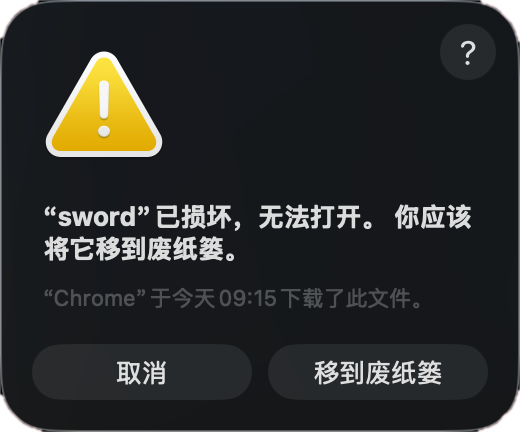

# ScanSword 项目介绍

## 项目定位

ScanSword 是一款基于 Nuclei 引擎的本地化安全测试桌面工作台，面向安全研究、红蓝对抗、渗透测试和日常漏洞验证场景，围绕以下高频链路做统一整合：

- POC 模板导入、兼容、筛选、编辑、批量管理
- 扫描任务创建、重扫、结果复核、导出
- 主动发包流量查看、被动流量监听、命中追踪
- 数据重放、请求调试、请求/响应包联动查看
- 指纹识别管理、主动探测、扫描前置识别
- AI 辅助 POC 规范化与指纹生成

它的核心目标不是只提供单点扫描能力，而是把“模板管理 -> 批量验证 -> 命中结果 -> 数据包复核 -> 请求重放 -> 指纹沉淀”收口到一个桌面工具里，减少在多个工具之间反复切换的成本。

- POC 仓库地址：[https://github.com/zg-sec/scansword-pocs](https://github.com/zg-sec/scansword-pocs)
- 版本发布地址：[https://github.com/zg-sec/scansword/releases](https://github.com/zg-sec/scansword/releases)

## 当前核心能力

### 1. POC 管理与导入

- 支持本地 POC 列表管理、分页浏览、关键词搜索、标签/作者/级别多维筛选。
- 支持 `severity:`、`tag:`、`author:` 等结构化高级搜索。
- 支持本地文件和目录导入，并展示实时进度、导入统计和失败原因。
- 兼容多类社区模板差异，覆盖常见 Nuclei 风格模板，以及部分 xray / 旧式规则风格写法。
- 支持模板编辑、保存、详情查看、从模板页直接发起单条或批量扫描。

### 2. 扫描任务与结果复核

- 支持创建批量扫描任务，配置目标、代理、速率、超时、请求头等参数。
- 支持任务列表查看、状态跟踪、进度展示、任务重扫。
- 支持“保存并重新下发”，并确保操作作用于当前任务本身，不会错位误扫。
- 支持扫描结果详情查看、请求包/响应包查看、发送到重放、结果导出。
- 导出时通过系统保存对话框选路径，默认文件名附带时间戳，降低覆盖风险。

### 3. 主动发包流量、被动流量监听与重放

- 支持主动发包流量查看，展示请求方法、URL、状态、大小、耗时、时间等信息。
- 主动发包流量支持来源识别、来源分组筛选、状态码颜色区分、详情查看和持久化保存。
- 支持被动流量监听，分为“流量日志”和“POC 命中”两部分。
- 被动链路先做指纹识别，再按配置决定是否自动触发 POC 验证。
- 扫描结果、抓包记录和命中结果都可以直接发送到重放页面继续验证。

### 4. 指纹识别与主动探测

- 指纹模块拆分为“指纹探测”和“指纹管理”两部分。
- 指纹模型已升级为 `matchers[] + matchers_condition`，兼容旧规则格式。
- 支持多目标主动探测、实时进度、代理设置、协议策略、结果导出。
- 支持指纹增删改查、去重、命中次数统计、绑定 POC、详情查看。
- 扫描前可结合指纹识别结果预选推荐 POC，缩短人工筛选链路。

### 5. AI辅助 测试

- 提供独立的 `AI辅助 测试` 页面，配置、缓存、SQLite、报告、主产物与复核区全部独立存放。
- 支持三种任务范围：
  - 规范 POC + 生成指纹
  - 仅规范 POC
  - 仅生成指纹
- 支持开始、继续、暂停、停止、重跑、核验、清空等完整控制动作。
- 支持基于 AI 对模板元数据做补全、规范化输出，并自动生成指纹候选结果。
- 任务完成后可做产物核验，只有核验通过的主产物才允许导入主库。

### 6. 设置与运行辅助

- 支持基础扫描配置、流量保存配置、代理证书操作、运行日志查看等统一管理。
- 支持下载和重置 MITM 根证书。
- 支持打开工作目录，便于直接查看本地数据和导出结果。
- 支持在线/离线双模式授权。

## 当前版本的重点特性

当前版本已经重点完善并稳定了以下主链路：

- POC 模板兼容导入与批量管理
- 扫描任务重扫、保存并重新下发、结果导出
- 主动发包流量与被动监听链路分流
- 请求/响应包查看、数据重放与二次验证
- 指纹探测、指纹管理和命中详情联动
- AI 辅助 POC 规范化与指纹生成工作区
- Windows / macOS / Linux 多平台桌面构建产物

## 适合的使用场景

- 需要长期维护大量 POC，并希望统一筛选、编辑和批量导入。
- 需要对多个目标做持续批量验证，并保留完整任务结果与复核链路。
- 需要把扫描结果、流量详情、请求重放、指纹识别串成一条连续工作流。
- 希望在一个本地桌面工具中完成模板管理、扫描执行、流量分析、请求调试和结果导出。

## 当前项目状态

ScanSword 当前已经具备完整的日常使用主链路：

- POC 导入与管理
- 批量扫描与任务追踪
- 命中结果查看与导出
- 主动发包流量与被动流量监听
- 数据重放与请求调试
- 指纹识别与主动探测
- AI 辅助规范化与指纹生成

当前版本定位为“本地化漏洞验证工作台”，核心功能已经可用，后续会继续围绕模板兼容性、扫描体验、结果复核链路、AI 规范化质量和跨平台稳定性持续增强。

## macOS 运行问题



如果 macOS 提示应用无法打开，通常是系统签名与隔离标记导致。可以在终端执行：

```shell
sudo xattr -dr com.apple.quarantine /Applications/scansword.app
```

注意：`/Applications/scansword.app` 需要替换成你本机实际的应用路径。

## 关注微信公众号

软件使用教程、POC 仓库更新、版本更新和功能介绍均通过微信公众号发布，请关注：`诸葛安全`


